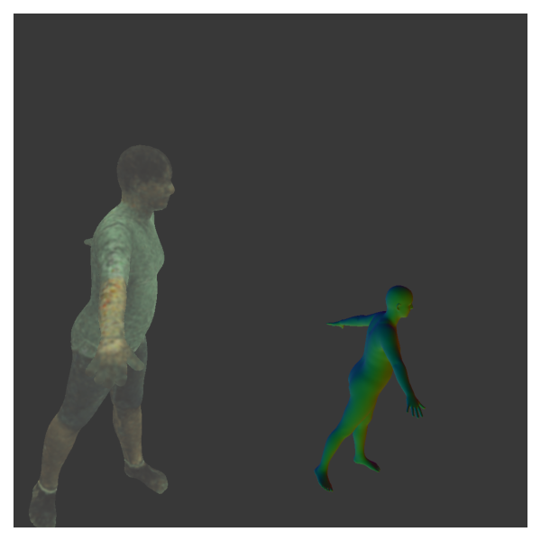

# Packages
1. pyrender
2. trimesh
3. cv2 
4. numpy

# Data
1. Camera Data
2. Meshes
3. Images 

# Run 
```
python pyrender_singleCam.py --frames 0 50
```
# Result 


# Multi(Interpolated) Cameras

## Camera Parameters
### 1. Naive Rasterizer
#### In camera class, **Wrong Cs**
```
self.pos = np.squeeze(-R @ tvec)
```

| |    |
|:--:|:--: |
| <b> cam1_18_wrongCs_t_0_010</b>|  <b>cam1_18_wrongCs_t-0_5_010.png</b>  |

||  |
|:--:|:--: |
| <b>cam1_18_wrongCs_t+1_010 </b>  |  <b>cam1_18_wrongCs_t-1_010</b>   |

### In camera class, **right Cs**
```
self.pos = np.squeeze(-np.transpose(R) @ tvec)
```


### 2. Pyrender
#### 2.1 **f_x & f_y**
