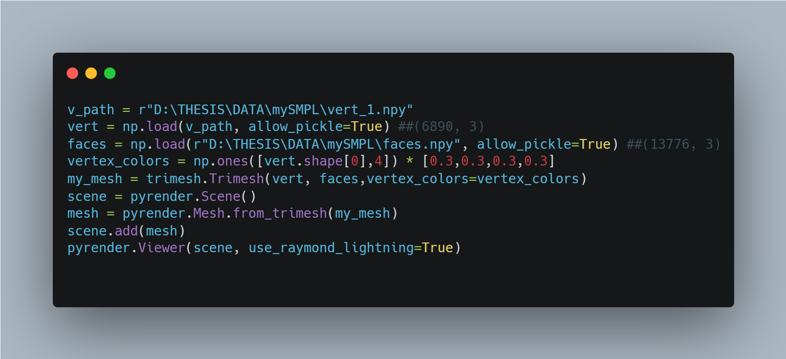

# Overview

## Prerequisite
1. smplx (``` pip install smplx ```)  [PyPi Project (pip)](https://pypi.org/project/smplx/)
2. pyrender (```pip install pyrender```)   [PyPi Project (pip)](https://pypi.org/project/pyrender/)
3. trimesh (```pip install trimesh```)  [PyPi Project (pip)](https://pypi.org/project/trimesh/)
## We need 
1) **Joints**  (24,3) [1 Global, 23 Body Joints] <br>
2) **Pose** (1,num_jointsx3=72) :open_file_folder: ```/home/group-cvg/cvg-students/das1/zju_mocap/CoreView_313/new_params/1.npy```<br>
🧮 We can use **smpl model** using 💎 ```pose parameters``` to get vertices and faces. <br>
a) **Vertices** (6890,3) :open_file_folder: ```/home/group-cvg/cvg-students/das1/zju_mocap/CoreView_313/new_vertices/1.npy``` <br>
b) **Faces** (13776,3) :open_file_folder: ```/home/group-cvg/cvg-students/das1/zju_mocap/CoreView_313/faces.npy```<br>

## Code
```
from smplx import SMPL  ### pip install smplx
import trimesh
import pyrender

## 1.vertices, faces can be read directly using the .npy files
###  Load SMPL Model    ### 
smpl = SMPL(model_path= <path to Gender.pkl file>, gender="MALE")

## 2. Using smpl with pose to get vertices and faces

my_mesh = trimesh.Trimesh(vertices, faces, vertex_colors)
scene = pyrender.Scene()
mesh = pyrender.Mesh.from_trimesh(my_mesh)
scene.add(mesh)
pyrender.Viewer(scene, use_raymond_lighting=True)
```

